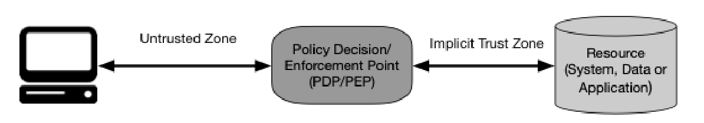

___
# INTRODUCTION
___

&nbsp;&nbsp;&nbsp;&nbsp;&nbsp;Perimeter-based network security model was used as the security model of the traditional networks. This model trusts anyone inside the corporate network called the trusted zone, and anyone outside wasn’t trusted. Due to the advancement of technology and complex human needs, the world is moving toward decentralized architectures from centralized architectures. Smart cities with various IOT devices, decentralized transaction systems, and decentralized applications (dapps) can be identified as the primary use cases of decentralized architectures. The security boundaries of the decentralized systems cannot be defined easily as done in the traditional centralized approach because it is impossible to divide the devices into two sets namely, internal and external devices based on their location. Because of that reason, these types of systems expose security vulnerabilities. One approach to overcome security vulnerabilities is Zero Trust Architecture (ZTA). In ZTA, there is no explicit trust in any user of the device and it is assumed that all users, devices, and packets are compromised regardless of their location. Based on that assumption, everyone should be authenticated and authorized before accessing a resource. The policy decision point (PDP) decides whether access is allowed or given to a particular resource (Logical decision). A policy enforcement point (PEP) creates the actual path from a user to the resource. Beyond the PDP/PEP, it is assumed an implicit trust zone and the size of the zone should be minimized. An abstract view of ZTA is shown in figure 1. To make decisions within the PDP data is required. CDM systems, industry compliance, threat intelligence, activity logs, data access policies, and public key infrastructures are some of the data sources for the PDP. In this research, our goal is to develop a machine learning model with the help of various PDP data sources and zero trust principles to make decisions dynamically  (allow/ deny) on various user-resource access scenarios.

|  | 
|:--:| 
| Figure 1 |
