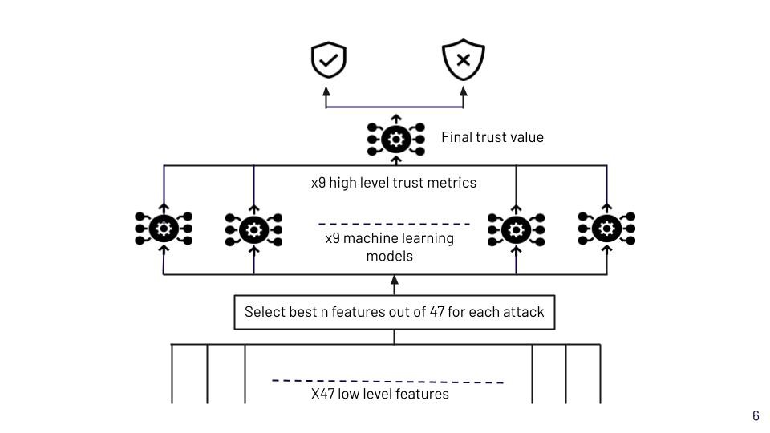

[comment]: # "This is the standard layout for the project, but you can clean this and use your own template"

# An Artificial Intelligence Inspired Zero Trust Model in Decentralized Edge Environment

#### Team

- E/16/242, Munasinghe A.V.S.S.A, [e16242@eng.pdn.ac.lk](mailto:e16242@eng.pdn.ac.lk)
- E/16/286, Piyarathna M.G.N.H, [e16286@eng.pdn.ac.lk](mailto:e16286@eng.pdn.ac.lk)
- E/16/399, Wijerathna D.G.K.E, [e16399@eng.pdn.ac.lk](mailto:e16399@eng.pdn.ac.lk)

#### Supervisors

- Dr. Upul Jayasinghe, [upuljm@eng.pdn.ac.lk](mailto:upuljm@eng.pdn.ac.lk)
- Dr. Suneth Namal Karunaratne, [namal@eng.pdn.ac.lk](mailto:namal@eng.pdn.ac.lk )

#### Table of content

1. [Abstract](#abstract)
2. [Related works](#related-works)
3. [Methodology](#methodology)
4. [Experiment Setup and Implementation](#experiment-setup-and-implementation)
5. [Results and Analysis](#results-and-analysis)
6. [Conclusion](#conclusion)
7. [Publications](#publications)
8. [Links](#links)

---

<!-- DELETE THIS SAMPLE before publishing to GitHub Pages !!!
This is a sample image, to show how to add images to your page. To learn more options, please refer [this](https://projects.ce.pdn.ac.lk/docs/faq/how-to-add-an-image/)
 -->

## Abstract
Zero trust is a security concept in which no entity or user is automatically trusted—instead, all access must be individually validated through a rigorous set of checks and controls. This approach is based on the idea that no environment can be fully trusted and that protection must be applied holistically across networks, applications, and workloads. Machine learning can be used to implement Zero Trust by enabling the application of dynamic, risk-based access policies based on real-time user behaviour. Machine learning algorithms can analyze characteristics such as device identity, authentication methods, and resource access patterns to identify anomalies and provide adaptive authentication methods for users. Additionally, machine learning can be used for continuous monitoring of user behaviour and malicious activity, allowing organizations to detect and prevent security threats. In this research, we have implemented a zero-trust model which follows the basic principles of zero trust such as Guaranteeing secure access to all resources, No implicit trust based on location, and Continuous verification using machine learning.
## Related works
The word “Zero Trust” was introduced by John Kindervag from Forrester Research and it is based on the principle of “Never trust Always Verify”.Forrester uses a centralized segmentation gateway with multiple zones and each zone includes a “microcore and perimeter” (MCAP ) interface. Forrester’s Next Generation Firewall (NGFW) is used as a segmentation engine and connected to multiple MCAPS. The segmentation engine receives the traffic from MCAP segments and forwards them into Data Acquisition Network (DAN) MCAPs in order to analyze them to make decisions about the clients.

Google BeyondCorp is a security framework that emphasizes a zero-trust approach to network security. Zero trust is a security model that assumes no user, device, or application can be trusted by default, even if they are inside the network perimeter. Instead, access to resources is based on identity, context, and policy, regardless of the user's location or the device they're using. BeyondCorp implements this model by using contextual information such as user identity, device security posture, and network location to enforce access controls and authorization decisions. This approach reduces the risk of data breaches and improves security posture for organizations, and it's used by Google to protect its own internal networks and employees can use network resources from any location without the need for a traditional VPN.

An Artificial Intelligence Approach for Deploying Zero Trust Architecture (ZTA)

The paper highlights the growing importance of Zero Trust Architecture (ZTA) as a cybersecurity framework for protecting organizational networks against advanced threats because the traditional approach of implementing ZTA can be challenging, time-consuming, and resource-intensive. The paper proposed a NIST-based policy engine which consists of static policies(a well-known fact by now), security feeds(To maintain the same security posture as older security controls) and ML policies. The final algorithm works as follows. First, it tries to make a decision based on static policies. If a decision cannot be made, security feeds are used to make the decision. If it fails to make a decision, the ML model is used to derive the decision.

## Methodology
Before doing anything data preprocessing was applied to the raw dataset and the following techniques were applied.

1. Data cleaning (Null, Missing, hex values)
  * If some column contains high Null values or missing values percentage, the corresponding column was dropped
  * Some columns contain values in hex format. Since model training is not possible with hex values, those values are converted to integer values
2. Creating attack-wise labels
  * Original dataset has a label called attack_type. But our task, it was required nine different labels for nine attack types.

| attack_type   |
| ------------- |
| Dos           | 
| Analysis      |

Before

| attack_type   | Dos  | Analysis  |
| ------------- |----- |---------- |
| Dos           | 1    |   0       |
| Analysis      | 0    |   1       |

After

3. Encode the categorical data to numerical format
4.  Splitting the data (60%,20%,20%) for train, test and online learning
  * 60%: training machine learning models
  * 20%: testing the models
  * 20%: online learning for better tuning of the models

Original dataset comes with 49 traffic features and around 2.5 million records. To reduce the computational complexity of model training, feature selection techniques were applied to select the most appropriate features. Following is the roadmap for the feature selection,

  * Remove features with High correlation
  * Used Information gain to reduce features
  * Used variable threshold method to identify constant features
  * Chi-Square statistical Analysis
  
When considering the methodology, dataset with selected features were fed into nine machine learning models. For one training model,

  * Only one attack label was fed. For Dos attacks,

| attack_type   | Dos  |
| ------------- |----- |
| Dos           | 1    |
| Analysis      | 0    |

  * To select the best algorithm for one machine learning model, a few algorithms were tried.
    * Logistic Regression
    * Decision Tree Regressor
    * Random Forest Regressor
    * K Nearest Neighbors Regressor
    * Deep Neural Network
    * SVM Regressor
    * Isolation Forest
    * One Class SVM

As the output of machine learning models probability values were taken out. Hence, for one traffic data, there will be nine different probability values corresponding to nine different attacks. Then for each machine learning model’s output, a suitable threshold value was defined based on accuracy and F1 score. In this way, we can get a direct idea about the attack type for a particular traffic data. As an example,

  * Threshold for DoS attacks: 90%

If we get a higher probability value than 0.9 when traffic data is fed into the model related to the DoS attacks, we can conclude that traffic data has a high probability to be a DoS attack.After that, it was required to combine nine probability values and derive one trust value. Here, ensemble learning techniques were used to derive the final trust value. Candidates used for this project are listed below,
 
  * Logistic Regression
  * Passive-aggressive Classifier
  * Approximate Large Margin Algorithm Classifier(ALMA)

At this point, we have the final trust value. Defining the boundary between trustworthiness and untrustworthiness can be done by considering the accuracy and F1 score. Furthermore, for better fine-tuning of the models, online learning was done using Logistic Regression, Passive-aggressive Classifier and Approximate Large Margin Algorithm Classifier(ALMA). The whole process is shown in figure 1.

## Experiment Setup and Implementation

## Results and Analysis

## Conclusion

## Publications
[//]: # "Note: Uncomment each once you uploaded the files to the repository"

<!-- 1. [Semester 7 report](./) -->
<!-- 2. [Semester 7 slides](./) -->
<!-- 3. [Semester 8 report](./) -->
<!-- 4. [Semester 8 slides](./) -->
<!-- 5. Author 1, Author 2 and Author 3 "Research paper title" (2021). [PDF](./). -->

## Links

[//]: # ( NOTE: EDIT THIS LINKS WITH YOUR REPO DETAILS )

- [Project Repository](https://github.com/cepdnaclk/e16-4yp-an-artificial-intelligence-inspired-zero-trust-model-in-decentralized-edge-environment)
- [Project Page](https://cepdnaclk.github.io/e16-4yp-an-artificial-intelligence-inspired-zero-trust-model-in-decentralized-edge-environment/)
- [Department of Computer Engineering](http://www.ce.pdn.ac.lk/)
- [University of Peradeniya](https://eng.pdn.ac.lk/)

[//]: # "Please refer this to learn more about Markdown syntax"
[//]: # "https://github.com/adam-p/markdown-here/wiki/Markdown-Cheatsheet"
